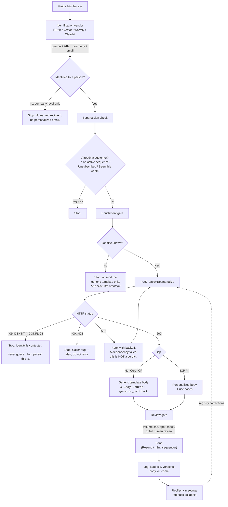

# Website visitor in, email out

The end-to-end design, and which parts exist today.

`/api/v1/personalize` is one stage of this — the decision layer. It classifies
and it writes. It does not identify visitors, does not know who is already a
customer, and does not send. Those are the stages around it, and the two live
runs behind this document say more about them than about the classifier.

---

## The pipeline



---

## What each stage owes the next

### 1. Identification — *not built here, and it decides everything*

The vendor must return a **person**, not just a company. Company-level
identification cannot produce a personalized email: there is no name to greet
and no role to classify.

It must also return the **job title**. This is the single most important
requirement in this document, and it is measured, not assumed — see below.

### 2. Suppression — *not built here, and the API cannot do it*

The API classifies; it has no idea who is already a customer. On the 29-row
list, two rows were existing customers and it happily personalized for one of
them. Suppression must happen **before** the call:

- existing customers and open opportunities (HubSpot)
- anyone in an active sequence
- unsubscribes and bounces
- a per-person cooldown, so a weekly visitor does not get a weekly email

### 3. The call

```jsonc
POST /api/v1/personalize
{
  "email": "reed@example-cre.com",
  "linkedin_url": "https://www.linkedin.com/in/...",
  "message_type": "website_visitor",
  "template_id": "website_visitor_use_case",
  "known_fields": {
    "first_name": "Reed",                // required
    "last_name": "Stillman",             // required
    "title": "VP, Investment Sales",     // ← the one that matters
    "company_name": "Example CRE",
    "company_domain": "example-cre.com", // used when the address is personal
    "location": "Vancouver, BC"          // the PERSON's location, see below
  },
  "additional_context": { "sender_name": "Jacob" }
}
```

Send an `Idempotency-Key` per (person, campaign). A retried webhook then
replays the identical body instead of writing a second, different email. The
key is namespaced by the request body, so reusing one key for a *different*
lead recomputes rather than handing you the first lead's email — check for
`X-Idempotent-Replay: true` if you need to know which happened.

Response is exactly six keys — `full_name`, `email`, `linkedin_url`, `icp`,
`icp_use_cases`, `email_body` — plus headers worth logging: `X-Body-Source`,
`X-Icp-Registry-Version`, `X-Prompt-Version`, `X-Handler-Ms`, `X-Stage-Ms`.

### 3b. Find-LinkedIn, when the caller has no URL

Omit `linkedin_url` and the route calls the n8n `Resolve LinkedIn Profile`
workflow (`bpx0okgj6Tslhwcb`) before classifying: Quick Enrich reverse-email →
AI Ark people search → Apollo `people/match` → Exa search judged by Gemini. Set
`N8N_LINKEDIN_WEBHOOK_URL`; leave it unset and the step no-ops, which is the
correct behaviour for both live surfaces since they already send a URL.

Three properties worth knowing before you rely on it:

- **`linkedinApproved` is the only field that authorises the URL.** Each branch
  sets it deliberately and the Gemini judge is instructed to reject rather than
  guess. A URL arriving unapproved is a *rejected candidate*, and this route
  discards it.
- **It also returns title and company.** That is the bigger prize: core recall
  runs 13% → 36% when a title is present (see below). No `/people` lookup
  follows a resolved URL — the cascade already answered that question.
- **It is fail-soft and capped at 6s.** Timeout, 500, unset env: all mean the
  lead is classified from its email alone. `X-Linkedin-Source` reports which
  vendor answered, and is absent when the step did not run.

`known_fields.location` — the person's location, not `additional_context.
territory` — is forwarded so the judge can tell two people with the same name
apart. It never reaches the email copy.

### 4. Routing the result

Jacob's rule — *"if someone doesn't match ICP we just send them template"* — is
implemented: `Not Core ICP` returns the approved generic body, not an error.

**Check `X-Body-Source`.** If you supplied your own `email_template` and the
lead comes back Not Core, your template is *replaced* by the approved generic.
That is correct per spec, but the body alone does not tell you it happened.

### 5. Errors, and which of them are verdicts

| Status | Meaning | Do |
|---|---|---|
| `409 IDENTITY_CONFLICT` | email domain contradicts the profile's employer | **Stop.** Do not fall back to generic — you do not know who this is |
| `400` / `422` | your request or your template is wrong | Stop, alert. Retrying will not help |
| `502` | a dependency failed | Retry with backoff. **Not** a classification |
| `429` | rate limited | Back off; `Retry-After` is set |

The 502 distinction is load-bearing. An earlier build returned a confident
`Not Core ICP` at HTTP 200 when a model fetch died mid-request — a caller would
have written that to HubSpot as a verdict. Transport failures are now errors.

### 6. Review gate — *keep it, at least at first*

Jacob's own framing was "these will be sent to people." Suggested progression:

1. **Now** — every email reviewed before send.
2. **Then** — auto-send `Not Core` generics (low risk, no claims), review anything personalized.
3. **Later** — auto-send both, with a daily volume cap and a spot-check sample.

Nothing about the current numbers justifies skipping stage 1.

### 7. Log and feed back

Log the lead, the label, `X-Body-Source`, all registry versions, and the body.
Versions are what make a bad email diagnosable three weeks later: they pin the
answer to the exact registry that produced it. Replies and meetings booked are
the only real accuracy signal, and they belong back in the registry.

---

## The title problem

**Every ICP in the registry gates on role.** #2 requires
Broker/Team Lead/VP/Analyst, #19 requires Partner/Principal/Associate/GP/MD.
Without a title, the classifier cannot confirm any of them and fails closed —
by design, because guessing is how a wrong ICP reaches a real person.

Measured on 400 rows of the labelled export, where the reference classifier had
titles and the API had only email + LinkedIn URL:

| | |
|---|---|
| Exact label agreement | 197/277 (71%) |
| **Core leads recovered** | **10 of 83 (12%)** |
| False positives | 2 |
| `ICP #2: CRE Broker` recall | **0 / 15** |
| `ICP #6: Founder` recall | 2 / 30 |
| `ICP #19: Investor` recall | 2 / 16 |

Replayed with title **and company** supplied — what an identification vendor
returns — after fixing the research question described below:

| | no title | with title + company |
|---|---|---|
| Core recall | 12% (10/83) | **61% (39/64)** |
| Exact-label recall | 6% (5/83) | **52% (33/64)** |
| False positives | 1% (2/194) | **3% (1/40)** |

Titles here were extracted from the reference's own reasoning, so 61% is an
upper bound, not a forecast. It is enough to say the input is the binding
constraint and not enough to call the accept path solved.

The rejection path is solid. The accept path barely functions without a title.
`robert.stillman@cbre.com` returns Not Core: CBRE is obviously a CRE firm, but
nothing in the input says whether he is a broker or an IT engineer.

### Why we cannot just look the title up

The obvious fix — resolve the title from the LinkedIn URL ourselves — was built
and tested on 8 of the missed leads. Titles came back for 8/8, but only 2
recovered the right label, and **two resolved the wrong person entirely**:

| lead | resolved as | reality |
|---|---|---|
| Karan Patel | Lead DeFi Quantitative Developer @ Blockchain.com | founder at a different company |
| Mohit Manhas | Associate @ Harmony Capital Advisors | founder at a different company |

Name-based web search cannot tell two people with the same name apart, and a
wrong title produces a *confident, personalized, wrong* email — worse than
sending nothing. **So title resolution belongs to the identification vendor,
which resolves the actual profile, not to a search heuristic.**

If a title genuinely cannot be obtained: send the generic template. That is the
Not Core path, and it is safe.

### A leading research question was rejecting whole ICPs

`ICP #2` scored 1/15 even with correct titles. The cause was ours: company
research asked *"does it primarily sell to startups?"* — the question the
startup-customer gates need — and it decided the ICPs that have no such gate.
Research for cbre.com returned "large enterprise, does not focus specifically on
startups", and a Vice Chairman at the largest commercial real-estate firm on
earth was rejected from an ICP whose `evidence_gate` is `"none"`.

The query now asks what the company *is*. CRE recall went 1/15 → 8/15 on the
spot, with false positives unchanged at 0/40.

### The classifier was not deterministic, and that is an acceptance criterion

Ten borderline CRE leads, three identical runs: **seven returned a different
label at least once.** The racing hedge in the model client fires a second
request and takes whichever replica answers first, and replicas disagree at
temperature 0.

The hedge is now off for classification, and — because a language model is not a
pure function — the label is cached against the evidence that produced it, keyed
by registry and prompt version. Same input, same label, by construction; change
a registry definition and every affected lead is reclassified. Re-measured:
**0/10 unstable**. `X-Classification` reports `fresh` or `cached`.

Note what this does and does not buy: it freezes the answer, it does not improve
it. A borderline lead is still decided by one model call, and that call is now
permanent until a version changes.

### The other half: the role lists are too narrow

Even with a correct title, two CRE leads still failed:

- **Vice Chairman @ CBRE** → Not Core
- **Director, Transactions Management @ JLL** → Not Core

Both are exactly the ICP #2 population, and neither title appears in
`Broker/Team Lead/VP/Analyst`. This is a **registry** fix, not a code fix —
`config/registry/icp_registry.json`, one field, versioned. Worth doing before
any conclusion is drawn about classifier accuracy on CRE.

---

## Cost and latency, per lead

| | |
|---|---|
| Latency | p50 3.2s, p95 6.4s (warm) |
| Exa research | ~$0.005, cached 3 days per domain |
| Fundable | 1–2 credits, person lookups cached 30 days |
| Model | DeepSeek V4 Flash, one call |

Fundable's `/people` is 19s cold and 2.6s warm ([FINDINGS #9](../FINDINGS.md)),
which is why identity lookups are cached and why nothing waits behind them.

---

## Testing it

Three suites, three questions:

```bash
npm run verify                           # typecheck + 130 offline tests + build
npx tsx scripts/contract-check.ts        # does the API behave to spec? (26 cases)
npx tsx scripts/evaluate-gold-set.ts     # macro-F1 / Not Core precision vs the baseline
npx tsx scripts/run-testset.ts           # does it agree with Jacob's hand calls? (29 rows)
npx tsx scripts/run-hard-rules.ts        # 21 hard-rule fixtures
npx tsx scripts/benchmark-real-titles.ts --csv <export.csv>   # paired bare/titled recall
```

`contract-check` runs cheap cases first, so a broken deploy fails in seconds.
Add `--cheap` to skip everything that costs an upstream call.

---

## Known limits, stated plainly

- **A caller's own template text is not claim-checked.** `approved_claims` is
  fail-closed for *catalog* copy. If you pass `email_template` containing "2,000
  startups a month", it ships verbatim — by design ([verify.ts](../packages/fundable-shared/src/verify.ts):
  "its own numbers and names are theirs, not ours"). Your templates, your claims.
- **The rate limit is per-instance and in-memory.** It resets on redeploy and
  does not coordinate across instances. Fine as a guard rail, not a quota.
- **Suppression, sending, and identification are all yours.** The API is one
  stage, deliberately.
- **The 19 use cases are proxies in places** — "expanding into a new geo" is
  matched by deal-text mentions, because no structured signal for it exists.
